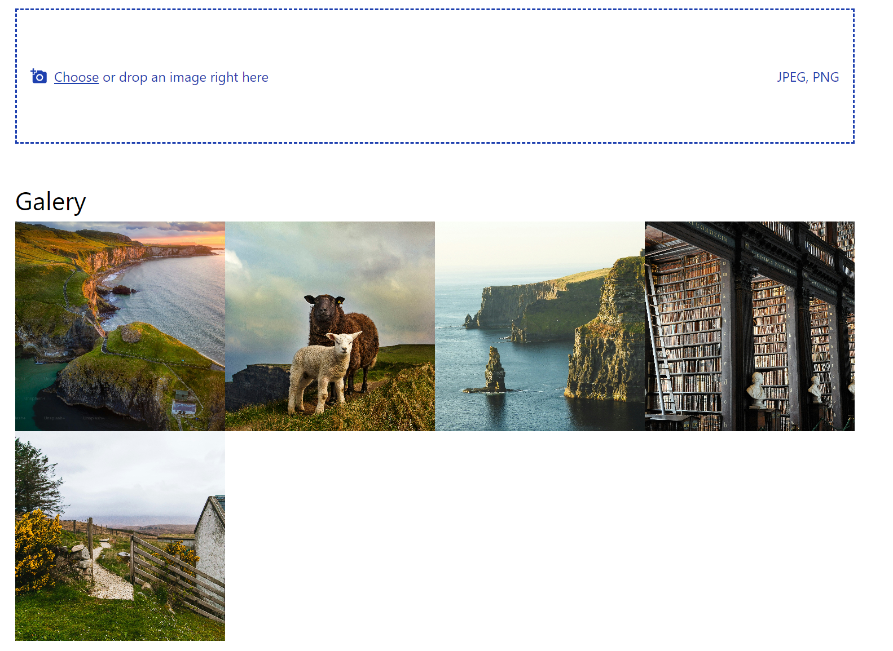
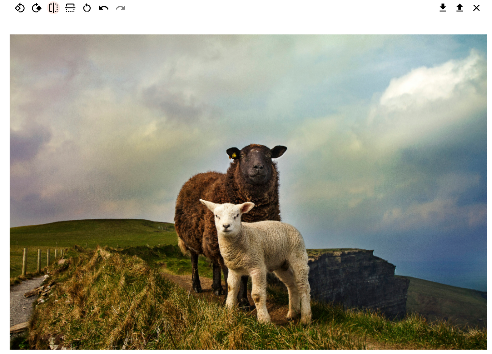

# Getting started

<video src="wiki-assets/20241105-2139-56.3809586.mp4" controls title="Title"></video>

Run the server:

> cd image-server\
> npm install\
> npm run build-run\
> cd ..

Run the client

> cd image-viewer\
> npm install\
> npm run dev

Features:

- upload local image by choosing or dragging a JPEG or PNG file.
- rotate the image left/right
- flip the image horizontally/vertically
- undo/redo action
- reset (it also clears undo/redo history)
- loading state during image upload
- fetch images array from graphql server
  - currently as json (name and url)

Comming soon features:

- api to upload image to a cloud bucket
- api to update image
- fetching library (TanStack Query)
